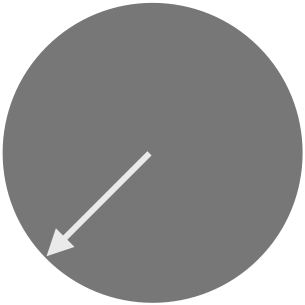

# Knobs knobs knobs

## Overview

While learning how to build audio plugins, I needed to generate animations
for turning a knob. This is accomplished by

1. Taking an image with the knob at _zero_.
1. Rotating the image as many times as we want until the pointer is at
   _eleven_ (the more intermediate images, the smoother the knob will be).
1. Stitching all the images together in a single image.

When it comes to building the UI for your audio plugin, you bind a parameter
to this image, and the engine will scrub through the animation as the parameter
value changes, making it look like the knob is turning.

After struggling with GIMP and Script-Fu for a bit, I decided to do this in
Python. I found a post by Thomas Faltenbach describing this exact problem,
along with some code, which I promptly ~~stole~~adapted. I believe I have
simplified a few things in the process.


## Back of the napkin

If you want to look at the code, this is roughly what's happening:


As you can see, the red knob needs to travel 270° between its minimum and
maximum positions, while the blue knob will need to travel 315°. If we want
to accomplish this with 10 images, we need to rotate each image by 30° each
time for the red knob, and 35° for the blue one.

I put together two very crude knobs showing what this looks like in action.
This is what both knobs look like when resting at _zero_:

 

These are the resulting animations:

 


## Installation

### Using `pip`

Until this is published to PyPI, you can install with `pip` by running

``` shell
$ pip install git+https://github.com/pfig/knobs.git#egg=knobs
```

### Manually

Clone the repository and install manually:

``` shell
$ git clone https://github.com/pfig/knobs.git
$ cd knobs
$ make install
```

## Usage

The installer will have given you a `knob` command:

``` shell
$ knob --help
usage: knob [-h] --knob KNOB --strip STRIP [--nframes NFRAMES] [--angle ANGLE]

Create knob animations for audio plugins.

options:
  -h, --help            show this help message and exit
  --knob KNOB, -k KNOB  Path to the knob image file. (default: None)
  --strip STRIP, -s STRIP
                        Path to save the knob animation strip. (default: None)
  --nframes NFRAMES, -n NFRAMES
                        Number of frames in the animation. (default: 10)
  --angle ANGLE, -a ANGLE
                        Starting angle for the knob rotation. (default: 225)
```

Assuming your original knob image lives in `knob.png` and you are happy with
the default number of frames (10) and the default initial angle (225) matches
the original image, you would run

``` shell
$ knob -k knob.png -s knob_strip.png
```

This would save the animation in `knob_strip.png`, which you can then use with
your virtual instrument.


## Roadmap

* Add support for generating sliders.

## Development

This is a `setuptools` project. There is a [`Makefile`](Makefile) with a bunch
of helper targets:

``` shell
$ make
clean                remove all development artefacts
clean-build          remove build artefacts
clean-pyc            remove Python compiled artefacts
clean-test           remove test and coverage artefacts
venv                 create isolated environment
install-dev          install for development
lint                 check style with black and flake8
black                format code with black
test                 run tests
coverage             check test coverage
install              install package and script
```

To get started, run `make venv` - this will create a Python virtualenv.
Activate the virtualenv with `source ./.venv/bin/activate`.

You can install an editable version of the module with `make install-dev`,
which will also install all the development dependencies.

You can check style and reformat the code with `make lint` and `make black`,
respectively.

Should you make any changes, `make test` and `make coverage` will run
the test suite for you, and measure test coverage.

Run `deactivate` when you are done making changes and testing.


[0]: https://medium.com/@thomas_99791/how-to-create-rotating-knob-stripes-for-audio-plugins-such-as-vst3-au-65b1dc6701a2 "Thomas Faltenbach's post"
